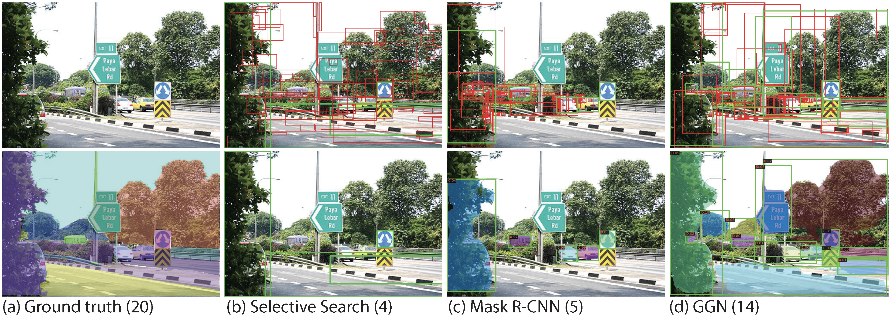
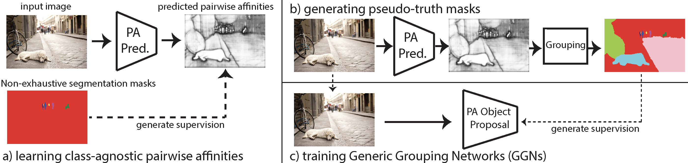

# Open-World Instance Segmentation: Exploiting Pseudo Ground Truth From Learned Pairwise Affinity

Pytorch implementation for "Open-World Instance Segmentation: Exploiting Pseudo Ground Truth From Learned Pairwise Affinity" ([CVPR 2022, link TBD]())  by [Weiyao Wang](https://sites.google.com/view/weiyaowang/home), [Matt Feiszli](), [Heng Wang](https://hengcv.github.io/), [Jitendra Malik](https://people.eecs.berkeley.edu/~malik/), and [Du Tran](https://dutran.github.io/). We propose a framework for open-world instance segmentation, **G**eneric **G**rouping **N**etwork (**GGN**), which exploits pseudo Ground Truth training strategy. On the same backbone, GGN produces impressive AR gains compared to closed-world training on cross-category generalization (**+11%** VOC to Non-VOC) and cross-dataset generalization (**+5.2%** COCO to UVO).

**What is it?** Open-world instance segmentation requires a model to group pixels into object instances without a pre-defined taxonomy, that is, both "seen" categories (those present during training) and "unseen" categories (not seen during training). There is generally a large performance gap between the seen and unseen domains. For example, a baseline Mask R-CNN miss 15 annotated masks in the example below. Without additional training data or annotations, Mask R-CNN trained with GGN framework produces **9** more segments correctly, being much closer to ground truth annotations.



**How we do it?** Our approach first learns a pairwise affinity predictor that captures correctly if two pixels belong to same instance or not. We demonstrate such pairwise affinity representation generalizes well to unseen domains. We then use a grouping module (e.g. MCG) to extract and rank segments from predicted PA. We can run this on any image dataset without using annotations; we extract highest ranked segments as "pseudo ground truth" candidate masks. This is a large and category-agnostic set; we add it to our (much smaller) datasets of curated annotations to train a detector.

 <br/>

**About the code.** This repo is built based on [mmdetection](https://github.com/open-mmlab/mmdetection) with the addition of [OLN](https://github.com/mcahny/object_localization_network) backbone (concurrent work). The repo is tested under Python 3.7, PyTorch 1.7.0, Cuda 11.0, and mmcv==1.2.5. We thank authors of OLN for releasing their work to facilitate research.

## Model zoo

Below we release PA predictor models, pseudo-GT generated by PA predictors and GGN trained with both annotated-GT and pseudo-GT. We also release some of the processed annotations from LVIS to conduct cross-category generalization experiments.

| Training | Eval | url | Baseline AR | GGN AR | Top-K Pseudo |
|:---:|:---:|:---:|:---:|:---:|:---:|
| Person, COCO | Non-Person, COCO | [PA](https://drive.google.com/file/d/1bNafmQz8LYzLl5vFKhhsQ8R6HS6rxWtw/view?usp=sharing)/[Pseudo](https://drive.google.com/file/d/1Tna7r1FJUMvcyKkuQ8_3Nm054j9g4QS9/view?usp=sharing)/[GGN](https://drive.google.com/file/d/13aeZFMy658wxkaEQtKpLJ5bEuMOi066P/view?usp=sharing) | 4.9 | 20.9 | 3 |
| VOC, COCO | Non-VOC, COCO | [PA](https://drive.google.com/file/d/1gRJVCUgtbn72XiyTfH6TtZt2AXXLGCj_/view?usp=sharing)/[Pseudo](https://drive.google.com/file/d/14udWTtiANG-lJYSwAqS3hnVZJKYE4xHi/view?usp=sharing)/[Pseudo-GGN](https://drive.google.com/file/d/1jxXB6S9b4jqfhfDwfiXIyQxvmIZ9Q5cm/view?usp=sharing)/ [GGN](https://drive.google.com/file/d/1IiepMOg89MhSM3PzpE_mycO2XRFw-YfV/view?usp=sharing)/[GGN-OLN]() | 19.9 | 28.7 (33.7 with OLN) | 3 |
| [COCO, LVIS](https://drive.google.com/file/d/10HbETuaCEMAUS6E62IzHoR1LoUhRS5O5/view?usp=sharing) | [Non-COCO, LVIS](https://drive.google.com/file/d/1k3blgwu76OrI8haQ8Z9PPB2NrPd98_PW/view?usp=sharing) | [PA](https://drive.google.com/file/d/1NjNP6cv1J7lOyl4m_0gZQ2q5yH0ieQZN/view?usp=sharing)/[Pseudo](https://drive.google.com/file/d/1q7OIp6S87iB2DaolizUkZXeAxzWk_5Oe/view?usp=sharing)/[GGN](https://drive.google.com/file/d/1THNSG_b5ymED1yFGa9_XouaIsFrqAnT3/view?usp=sharing) | 16.5 | 20.4 | 1 |
| [Non-COCO, LVIS](https://drive.google.com/file/d/11OmQiuv-6FIArnxaxC1BjbE1f5GQ-wt-/view?usp=sharing) | COCO | [PA](https://drive.google.com/file/d/1hqPRfP8PJIv712YGRYZ29Ppzai-T8Mae/view?usp=sharing)/[Pseudo](https://drive.google.com/file/d/1JYmowzwspI59mkOreGt-KUhaH487Xp-V/view?usp=sharing)/[GGN](https://drive.google.com/file/d/1VH0ucII1evxplnoX6-46TRVD5-Tm_loR/view?usp=sharing) | 21.7 | 23.6 | 1 |
| COCO | UVO | [PA](https://drive.google.com/file/d/1qbsbDXQ9-vBKJnBhziRk9Ws8ZTOAkjlN/view?usp=sharing)/[Pseudo](https://drive.google.com/file/d/1vVsuS8Z3KHy4DJMZmKPZkzwBcJEYUqWz/view?usp=sharing)/[GGN](https://drive.google.com/file/d/1JNoI6_sPDZPbrBvoouJfEpNSs01G0Alb/view?usp=sharing) | 40.1 | 43.4 | 3 |
| COCO, random init  | ImageNet | [PA](https://drive.google.com/file/d/1o0uzCTQ__6Ju3pIgBWWesUZG-fFzdCuZ/view?usp=sharing)/[Pseudo](https://drive.google.com/file/d/1CA-f4YSoWKzzPeoBGTdL9zvck01inmh4/view?usp=sharing)/[GGN](https://drive.google.com/file/d/1V2pX52BdhzA2GCfx9lMTC0MK9QjHeI2w/view?usp=sharing) |  |  | 10 |

We remark using large-scale pre-training in the last row as initialization and finetune GGN on COCO with pseudo-GT on COCO gives further improvement (45.3 on UVO), with [model](https://drive.google.com/file/d/1daSPUOJkThDFLdVW-PhL5b8kIMIerP-3/view?usp=sharing).

## Installation

This repo is built based on [mmdetection](https://github.com/open-mmlab/mmdetection).

You can use following commands to create conda env with related dependencies.
```
conda create -n ggn python=3.7 -y
conda activate ggn
conda install pytorch=1.7.0 torchvision cudatoolkit=11.0 -c pytorch -y
pip install mmcv-full
pip install -r requirements.txt
pip install -v -e .
```
Please also refer to [get_started.md](docs/get_started.md) for more details of installation.

Next you will need to build the library for our grouping module:
```
cd pa_lib/cython_lib
python3 setup.py build_ext --inplace
```

## Data Preparation

Download and extract COCO 2017 train and val images with annotations from
[http://cocodataset.org](http://cocodataset.org/#download).
We expect the directory structure to be the following:
```
path/to/coco/
  annotations/  # annotation json files
  train2017/    # train images
  val2017/      # val images
```

Our work also uses [LVIS](https://www.lvisdataset.org/), [UVO](https://sites.google.com/view/unidentified-video-object/home) and [ADE20K](https://groups.csail.mit.edu/vision/datasets/ADE20K/). To use ADE20K, please convert them into COCO-style annotations.

## Training of pairwise affinity predictor

```
bash tools/dist_train.sh configs/pairwise_affinity/pa_train.py ${NUM_GPUS} --work-dir ${WORK_DIR}
```

## Test PA

We provide a tool `tools/test_pa.py` to directly evaluate PA performance (e.g. on PA prediction and on grouped masks).

```
python tools/test_pa.py configs/pairwise_ffinity/pa_train.py ${WORK_DIR}/latest.pth --eval pa --eval-proposals --test-partition nonvoc
```

## Extracting pseudo-GT masks

We first begin by extracting masks. Example config `pa_extract.py` extracts pseudo-GT masks from PA trained on VOC subsets of COCO. `use-gt-masks` flag asks the pipeline to compute maximum IoU an extracted masks has with the GT. It is recommended to split the dataset into multiple shards to run extractions. On original image resolution and Nvidia V100 machine, it takes about 4.8s per image to run the full pipeline (compute PA, run grouping, ranking then compute IoU with annotated GT) without globalization and trained ranker or 10s with globalization and trained ranker.
```
python tools/extract_pa_masks.py configs/pairwise_affinity/pa_extract.py ${PA_MODEL_PATH} --out ${OUT_DIR}/masks.json --use-gt-masks 1
```

The extracted masks will be stored in JSON with the following format

```
[
  [segm1, segm2,..., segm20] ## Result of an image
  ...
]
```

We refer to `tools/merge_annotations.py` for reference on formatting the extracted masks as a new COCO-style annotation file. We remark that `tools/interpolate_extracted_masks.py` may be necessary if not running extraction on original image resolution.

## Training of GGN

Please specify `additional_ann_file` with the extracted pseudo-GT in previous step in `class_agn_mask_rcnn_pa.py`.

```
bash tools/dist_train.sh configs/mask_rcnn/class_agn_mask_rcnn_pa.py ${NUM_GPUS}
```

`class_agn_mask_rcnn_gn_online.py` is used to train ImageNet extracted masks since there are too many annotations and we cannot store everything in a single json file without OOM. We will need to break it into per-image annotations in the format of "{image_id}.json".

## Testing

```
python tools/test.py configs/mask_rcnn/class_agn_mask_rcnn.py ${WORK_DIR}/latest.pth --eval segm
```

## To cite this work

```bibtex
@article{wang2022ggn,
  title={Open-World Instance Segmentation: Exploiting Pseudo Ground Truth From Learned Pairwise Affinity},
  author={Wang, Weiyao and Feiszli, Matt and Wang, Heng and Malik, Jitendra and Tran, Du},
  journal={CVPR},
  year={2022}
}
```
